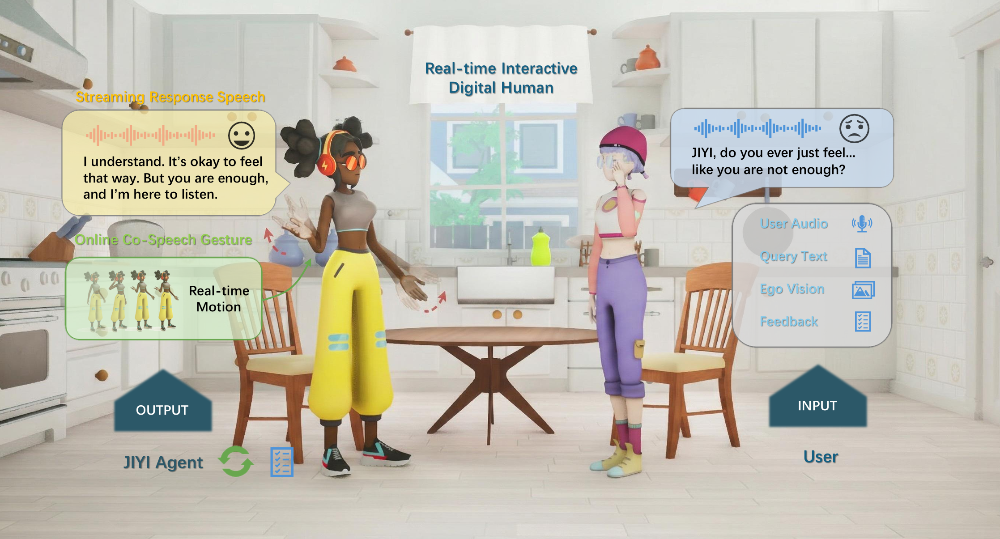
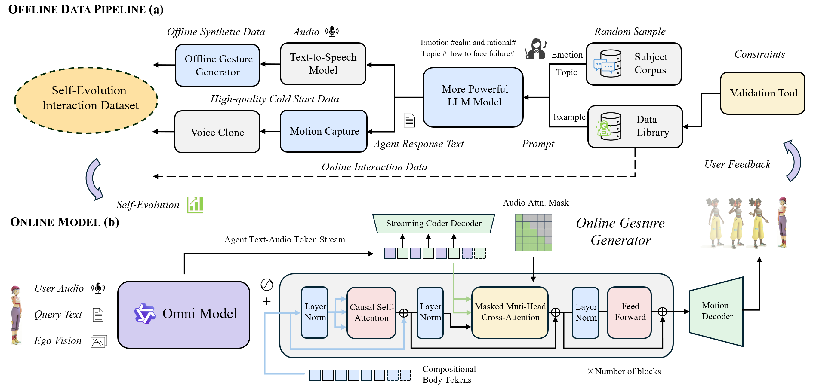

<div align="center">

# Super Star: Towards Streaming Real-time Interactive <br> Agents for Digital Humans
<h3 align="center"><strong>🎉🎉ACM MM 2026🎉🎉</strong></h3>

  > *" You are the electricity, you are the light, you are the only myth. <br>
  > I only love you, you are my <b><span style="color: rgb(201, 138, 1);">Super Star</span></b>." &nbsp;&nbsp;&nbsp;&nbsp;—— S.H.E*

<p align="center">
  <a href='https://arxiv.org/abs/2503.16973v3'></a><a href='https://arxiv.org/pdf/2503.16973v3'></a><a href='https://super-star-2026.github.io/'></a><a href="" target='_blank'></a>
</p>
</div>

This paper is **on hold** on arXiv.  **You can find our paper in ./assets/super_star_arxiv.pdf!**
This repository contains the official implementation of "Super Star: Towards Streaming Real-time Interactive Agents for Digital Humans".

## 🔍 Overview

Super Star enables 3D digital humans to interact with users in real-time and generate speech synchronization gestures online based on user multimodal input via an online real-time interactive pipeline, which is trained through our closed-loop self-evolving data pipeline to support continual adaptation to user preferences.



## 📣News
- [2026.08.14] **You can find our paper in ./assets/super_star_arxiv.pdf!**
- [2026.08.14] We release the training, inference and evaluation code.
- [2026.07.22] We release the paper and project page of Super Star. However, the paper is **on hold** on arXiv. 
- [2026.07.10] Our paper has been accepted by ACM Multimedia 2026. 🎉🎉🎉

## 🌟System Framework



## Online Real-time Interaction Pipeline 

This pipeline for real-time online interaction with users includes two coupled modules, a Streaming Speech Response module and a Online Gesture Generator module.

### Module 1  Streaming Speech Response 

We use Qwen3-omni to generate streaming response speech. Ensure that the CUDA driver version is greater than or equal to 12.4.

#### Transformers Usage

Please follow the instructions from [Qwen3-omni](https://github.com/QwenLM/Qwen3-Omni) to install required packages. Then, you can generate agent response audio based on your multimodal input.

#### vLLM-omni Usage

If you intend to deploy an API service, we recommend using vLLM-Omni to generate agent response audio. For more details, please refer to the vLLM-Omni official [offline inference documentation](https://docs.vllm.ai/projects/vllm-omni/en/latest/user_guide/examples/offline_inference/qwen3_omni/) and [online inference documentation](https://docs.vllm.ai/projects/vllm-omni/en/latest/user_guide/examples/online_serving/qwen3_omni/).

```bash
conda create -n qwen3-omni python=3.11 -y
conda activate qwen3-omni
pip install vllm
git clone https://github.com/vllm-project/vllm-omni.git
cd vllm-omni

pip install -e .
pip install soundfile librosa

# Install system audio tools
sudo apt-get update
sudo apt-get install -y ffmpeg

#Download Model
pip install -U huggingface_hub
hf download Qwen/Qwen3-Omni-30B-A3B-Instruct --local-dir <model_path>/Qwen3-Omni-30B-A3B-Instruct

# Start service
CUDA_VISIBLE_DEVICES=0 vllm serve <model_path>/Qwen3-Omni-30B-A3B-Instruct --omni --served-model-name qwen3-omni --host 127.0.0.1 --port 8000 --dtype bfloat16 --trust-remote-code --gpu-memory-utilization 0.9
```

### Module 2  Online Gesture Generator 

#### License Notices

We have tried our best to promote open source and thanks for the community's understanding. Considering that the JIYI dataset is an internal asset of the company, we are not open-sourcing the raw data and trained models. Users can use their own collected data to train the deployable models. Below, we refer to [Semantic-Gesticulator-Official](https://github.com/LuMen-ze/Semantic-Gesticulator-Official) and use the Zeroegg dataset as a replacement to describe our implementation process.

---

#### Table of Contents

- [Environment Setup](#environment-setup)
- [Pretrained Models](#pretrained-models)
- [Inference](#inference)
- [Training (for Motion Tokenizer and Online Gesture Generator)](#training-for-motion-tokenizer-and-online-gesture-generator)
  - [Data Preparation](#data-preparation)
  - [Training Residual VQ](#training-residual-vq-corresponding-to-modelresidual_vqpy)
  - [Training Online Base Model](#training-online-base-model)
- [Evaluation](#evaluation)

---

#### 🛠️Environment Setup

Create the required Python environment:

```bash
conda create -n superstar python=3.12.7 -y
conda activate superstar
pip install -r requirements.txt
pip install -U openai-whisper
```

#### 📦Pretrained Models

Download the pretrained models for Online Gesture Generator (Residual VQ-VAE & Base Model) from [Hugging Face](https://huggingface.co/jskuba/Super-Star) and place them in the `pretrained_models` directory.

#### 🔥Inference

To run inference and generate gestures from an audio file:

-   Ensure your audio file is in .wav format.

-   Fill in the appropriate audio_path (your audio file path) and save_dir (output directory) in the command below.

-   We only use the first layer codebook of RQVAE for decoding, without accumulating residual layers, which corresponds to the VQVAE of the online model in our paper.


```bash
CUDA_VISIBLE_DEVICES=0 torchrun --nproc_per_node=1 --master_port=29502 generate_gestures.py \
  --audio_path <audio_file_path> \
  --save_dir <save_dir> \
  --rqvae_path './pretrained_models/rqvae.pt' \
  --model_path_0 './pretrained_models/base_0.pt' \
  --init_body_pose_code 128 \
  --init_hands_pose_code 258 \
  --processed_dataset_dir './Data/SG_processed'\
  --only_base_layer
```

Note1: --init_body_pose_code and --init_hands_pose_code parameters need to be specified based on the representation of different datasets.

Note2: Please ensure that the scikit-learn version used to save the audio_feature_scaler.sav and body_scaler.sav files during preprocessing is consistent with the version used during inference. Loading scalers across versions may lead to inconsistent scale/mean values, potentially resulting in inaccurate results.

#### 🔄Training (for Motion Tokenizer and Online Gesture Generator)

#### 🗃️Data Preparation

Prepare the dataset for training:

1.  Download the dataset from [google drive](https://drive.google.com/file/d/1_-36bUbpOl2eC67o14EPQ5_ZhOnggA9q/view?usp=sharing), and place them in the `./Data/SG_Data/zeroeggs` directory. 

2.  Run the following command to preprocess the data:

```bash
python prepare_data.py --data_dir Data/SG_Data/zeroeggs --save_dir Data/sg_processed
```

  The processed results will be saved in the `./Data/sg_processed` directory.

3. Merge h5 files into one file to accelerate data loading during training:

```bash
python h5_merge.py --data_dir Data/sg_processed/h5 --save_h5 Data/sg_processed/merged.h5
python h5_merge.py --data_dir Data/sg_processed/h5_audio --save_h5 Data/sg_processed/merged_audio.h5
```

#### Training Residual VQ (Corresponding to ./Model/residual_vq.py)

You can train the Resudial-VQVAE model by running the following command:

```bash
CUDA_VISIBLE_DEVICES=0,1 torchrun --nproc_per_node=2 --master_port=29500 main_motion_vqvae.py --config Config/motion_rvq_train.yaml --train
```

 And then you will get a rvq model as a motion tokenizer and only use the first layer codebook as the VQVAE for decoding online.

####  Training Online Base Model

After you get the rvq model, please set the `vqvae_weight` to the path of the rvq model in `./Config/motion_gpt_super_star.yaml` file.

Then running the following command to train the online base model (online gesture generator):

##### Base Model  (Corresponding to ./Model/cross_cond_gpt2_2part_audio_causal_cross.py):

```bash
CUDA_VISIBLE_DEVICES=0,1 torchrun --nproc_per_node=2 --master_port=29500 main_motion_gpt.py --config Config/motion_gpt_super_star.yaml --train
```

#### 📝Evaluation 

1.  Place test set audio in the `./data_test/audio/` and the corresponding GT motion (.bvh) in  `./data_test/gt_motion/` directory. 

2.  Run the following command to generate predicted motion file (e.g. bvh format) :

```bash
# Specify the path of the test set audio folder to be traversed
AUDIO_DIR="./data_test/audio/"

for filepath in "${AUDIO_DIR}"/*.wav
do
    # Extract the file name (excluding path and extension)
    file=$(basename "${filepath}" .wav)

    CUDA_VISIBLE_DEVICES=0 torchrun --nproc_per_node=1 --master_port=29502 generate_gestures.py \
      --audio_path "${AUDIO_DIR}/${file}.wav" \
      --save_dir './results_online' \
      --eval_dir './data_test/pred_motion_online' \
      --rqvae_path './pretrained_models/rqvae.pt' \
      --model_path_0 './pretrained_models/base_0.pt' \
  	  --init_body_pose_code 128 \
      --init_hands_pose_code 258 \
      --processed_dataset_dir './Data/SG_processed'\
      --only_base_layer
done
```

  The predicted motion results will be saved in the `./data_test/pre_motion/` directory.

3. Install evaltools from [EMAGE](https://github.com/PantoMatrix/PantoMatrix) and run the following command to calculate metrics: 

```bash
git clone https://huggingface.co/H-Liu1997/emage_evaltools
python evaluate_motion.py --pred_bvh_dir "./data_test/pred_motion_online/"
```

Note: --eval_index and --num_joints parameters need to **be specified** based on the representation of **different datasets**.


## Offline Data Pipeline

### Text-to-Speech Model

Create the required Python environment:

```bash
conda create -n tts python=3.10
conda activate tts
```

<details>

Please follow the instructions from [IndexTTS](https://github.com/index-tts/index-tts) to install this package. Then, you can generate audio with emotions based on the dialogue text.

```bash
from indextts.infer_v2 import IndexTTS2
tts = IndexTTS2(cfg_path="checkpoints/config.yaml", model_dir="checkpoints", use_fp16=False, use_cuda_kernel=False, use_deepspeed=False)
emotion_list = ["happy", "angry", "sad", "afraid", "calm"]
emtion_vector = {
    "happy": [0.2, 0, 0, 0, 0, 0, 0, 0],
    "angry": [0, 0.1, 0, 0, 0, 0, 0, 0],
    "sad":   [0, 0, 0.2, 0, 0, 0, 0, 0],
    "afraid":[0, 0, 0, 0.2, 0, 0, 0, 0],
    "calm":  [0, 0, 0, 0, 0, 0, 0, 0.3]
    }
text_list ={"happy": [
    "Hugging you, get some rest soon",
    "Of course! Happy to keep you company!",
    "..."
    ],
    
    "angry": ["..."], 

    "sad": [
    "I’m so... tired today",
    "..."
    ],

    "afraid": ["..."], 

    "calm": [
    "Hi, JIYI, can you chat with me? ",
    "How do you face failure?",
    "..."
    ], 
} 

for emotion in emotion_list:
    for i in range(len(text_list[emotion])):
        tts.infer(spk_audio_prompt='examples/reference_voice.wav', text=text_list[emotion][i], output_path=f"jiyi/{emotion}_gen_{i}.wav", emo_vector=emtion_vector[emotion], use_random=False, verbose=True)
```
</details>

### Offline Gesture Generator 

Offline gesture generator, without the strict constraints of real-time online processing, can obtain future speech information to ensure better generation quality.

#### 📦Pretrained Models

Download the pretrained models for Offline Gesture Generator (Residual VQ-VAE & Base Model & Finetuning Layers) from [Hugging Face](https://huggingface.co/jskuba/Super-Star) and place them in the `pretrained_models` directory.


#### 🔥Inference

To run inference and generate gestures from an audio file:

-   Ensure your audio file is in .wav format.
-   Fill in the appropriate audio_path (your audio file path) and save_dir (output directory) in the command below.


```bash
CUDA_VISIBLE_DEVICES=0 torchrun --nproc_per_node=1 --master_port=29502 generate_gestures.py \
  --audio_path <audio_file_path> \
  --save_dir <save_dir> \
  --rqvae_path './pretrained_models/rqvae.pt' \
  --model_path_0 './pretrained_models/base_0_offline.pt' \
  --model_path_1 './pretrained_models/finetuning_1.pt' \
  --model_path_2 './pretrained_models/finetuning_2.pt' \
  --model_path_3 './pretrained_models/finetuning_3.pt' \ 
  --init_body_pose_code 128 \
  --init_hands_pose_code 258 \
  --processed_dataset_dir './Data/SG_processed'
```

#### 🔄Training (for Offline Gesture Generator)

You haved trained the Resudial-VQVAE model in the previous steps of training the online model. After you get the rvq model, please set the `vqvae_weight` to the path of the rvq model in below files:

- `./Config/motion_gpt_super_star_offline.yaml`
- `./Config/motion_fine_gpt_rq_level_1.yaml`
- `./Config/motion_fine_gpt_rq_level_2.yaml`
- `./Config/motion_fine_gpt_rq_level_3.yaml`

Then you need to train 1 offline base models and 3  finetuning layers for 4 different RVQ layers by running the following command one by one:

##### Offline Base Model  (Corresponding to ./Model/cross_cond_gpt2_2part_audio_cross.py):

```bash
CUDA_VISIBLE_DEVICES=0,1 torchrun --nproc_per_node=2 --master_port=29500 main_motion_gpt.py --config Config/motion_gpt_super_star_offline.yaml --train
```

##### Finetuning Layer 1-3 (Corresponding to ./Model/fine_gpt2_2part_audio_cross.py):

```bash
CUDA_VISIBLE_DEVICES=0 torchrun --nproc_per_node=1 --master_port=29500 main_motion_gpt.py --config Config/motion_fine_gpt_rq_level_1.yaml --train

CUDA_VISIBLE_DEVICES=1 torchrun --nproc_per_node=1 --master_port=29501 main_motion_gpt.py --config Config/motion_fine_gpt_rq_level_2.yaml --train

CUDA_VISIBLE_DEVICES=2 torchrun --nproc_per_node=1 --master_port=29502 main_motion_gpt.py --config Config/motion_fine_gpt_rq_level_3.yaml --train
```

Note: These four commands can be executed together.

## Super Star on BEATv2 Dataset

We keep the model architecture as similar as possible to [LOM](https://github.com/Juzezhang/language_of_motion) for fair comparison.

```bash
cd super_star_beatv2
```

### 🛠️ Environment Setup
<details>

We use Conda for environment management. Follow these steps to set up the development environment:

```bash
# Create and activate the conda environment
conda create --name lom -y python=3.10
conda activate lom

# Install PyTorch with CUDA support
conda install pytorch==2.4.0 torchvision torchaudio pytorch-cuda=12.1 -c pytorch -c nvidia
# Alternative for RTX 5090 users: install pytorch by following way
# pip install --pre torch torchvision torchaudio --index-url https://download.pytorch.org/whl/nightly/cu128

# Install pip and dependencies
python -m pip install pip==21.3
pip install -r requirements.txt

# Install additional packages
pip install turbot5 -U
# Alternative for RTX 5090 users: upgrade triton to support the new architecture
# pip install --upgrade "git+https://github.com/openai/triton.git@main#egg=triton&subdirectory=python"
# export TRITON_JIT_CUDA_ARCHITECTURES=$(
#   python - <<'EOF'
# import torch
# p = torch.cuda.get_device_properties(0)
# print(f"{p.major}{p.minor}")
# EOF
# )

# Install NLP tools
python -m spacy download en_core_web_sm

# Set up fairseq (required for some components)
mkdir -p third_party
cd third_party
git clone https://github.com/pytorch/fairseq
cd fairseq
pip install --editable ./
cd ../..

# Version Conflict
pip install --upgrade "omegaconf>=2.2,<2.4" "hydra-core>=1.3,<1.4"
```

#### Setting Up Blender for Rendering

We use [TEMOS](https://github.com/Mathux/TEMOS) for rendering. Install it with our provided script:

```bash
# Execute the setup script to install Blender and its dependencies
chmod +x setup_blender.sh
./setup_blender.sh
```

This script will:
1. Download and extract Blender 2.93.18
2. Verify the Blender Python path
3. Install all necessary Python packages for rendering


</details>

### 📥 Required Resources

<details>

Please register an account on the [Max Planck Institute for Intelligent Systems (MPI-IS) website](https://smpl-x.is.tue.mpg.de/index.html) to access the necessary SMPLX models. Then download the SMPLX models, Hubert, T5, and T2M metrics computation checkpoints by running the following script:

```bash
chmod +x build_resources.sh
./build_resources.sh
```

After running the script, you will have the following directory structure:
```
model_files/
├── hubert_models/     # Hubert audio tokenizer models
├── smplx_models/      # SMPLX body models
├── FLAME2020/         # FLAME face models
├── t2m_evaluators/    # Text-to-Motion evaluation metrics
└── t5_models/         # T5 language models
```
</details>

### 📦 Pretrained Models

<details>

Pretrained models are gradually uploading!

</details>

### 🚀 Quick Start

<details>
<summary><b>Co-speech Gesture Generation</b></summary>

```bash
python demo.py --cfg configs/demo_cospeech.yaml --audio examples/2_scott_0_111_111.wav --task cospeech --render
```
After running the demo scripts, the generated motion results (including rendered videos and motion data) will be saved in the `./results` directory.  The results will include synchronized motion and audio in a single video file.

</details>


### 🗃️ Data Preparation

For detailed instructions on data preparation and preprocessing, please refer to the [Datasets Guide](./preprocess/README.md).

### 🔄 Training 

<details>
<summary><b>1. Compositional Motion Tokenization (VQ-VAE Training)</b></summary>
For fair comparison, we use compositional motion tokenization (VQ-VAE) checkpoints from [EMAGE](https://github.com/PantoMatrix/PantoMatrix) (vq_emage_speaker_2.ckpt) and the audio tokenizer, Hubert, from [LOM](https://github.com/Juzezhang/language_of_motion). Run the following command to get audios_token:

```bash
python -m scripts.get_speech_code_beat2 --beat2_root "/path/to/your/beat2"
```

The audio tokenizer can be replaced by other versions and the detailed tokenization of [LOM](https://github.com/Juzezhang/language_of_motion) is here (📖 [Detailed Documentation](./Compositional_Tokenization.md)).

</details>

<details>
<summary><b>2. Online Gesture Generator (Corresponding to ./lom/archs/lom_audio_causal.py)</b></summary>

```bash
 python -m train --cfg configs/config_mixed_stage3_a2m_audio_causal_super_star.yaml --nodebug</details>
```
</details>

### Evaluation
To evaluate the co-speech metrics, please first update the trained model checkpoint paths in `configs/config_mixed_stage3_a2m_audio_causal_super_star.yaml`:

- `TEST.CHECKPOINTS_FACE`
- `TEST.CHECKPOINTS_HAND` 
- `TEST.CHECKPOINTS_UPPER`
- `TEST.CHECKPOINTS_LOWER`
- `TEST.CHECKPOINTS_GLOBAL`
- `TEST.CHECKPOINTS`

Then, run the following command:

```bash
python -m test --cfg configs/config_mixed_stage3_a2m_audio_causal_super_star.yaml
```

**Note:** The evaluation result is provided in the ` super_star_beatv2/result/lom/Instruct_Mixed_A2M_Causal/ ` directory.

## 📝 Citation

If you find our work useful for your research, please consider citing:

```bibtex
@article{jiang2026super,
  title={Super Star: Towards Streaming Real-time Interactive Agents for Digital Humans},
  author={Jiang, Wentao and Xie, Youchen and Fan, Haidi and Chen, Yajing and Wang, Xin and Wang, Jingya and Shi, Ye},
  booktitle={Proceedings of the 35nd ACM International Conference on Multimedia},
  year={2026}
}
```

## Acknowledgements

This project builds upon several outstanding works. We sincerely thank the following contributors:

- [Qwen3-Omni](https://github.com/QwenLM/Qwen3-Omni) — End-to-end multilingual omni-modal foundation models, which provides real-time streaming speech responses used in our online real-time interaction pipeline.
- [Semantic-Gesticulator-Official](https://github.com/LuMen-ze/Semantic-Gesticulator-Official) — End-to-end multilingual omni-modal foundation models, which provides real-time streaming speech responses used in our online real-time interaction pipeline.
- [LOM](https://github.com/Juzezhang/language_of_motion) — A co-speech gesture generation method that serves as an important baseline and reference.
- [IndexTTS](https://github.com/index-tts/index-tts) — An industrial-level controllable and efficient text-to-speech system for our data synthesis.
